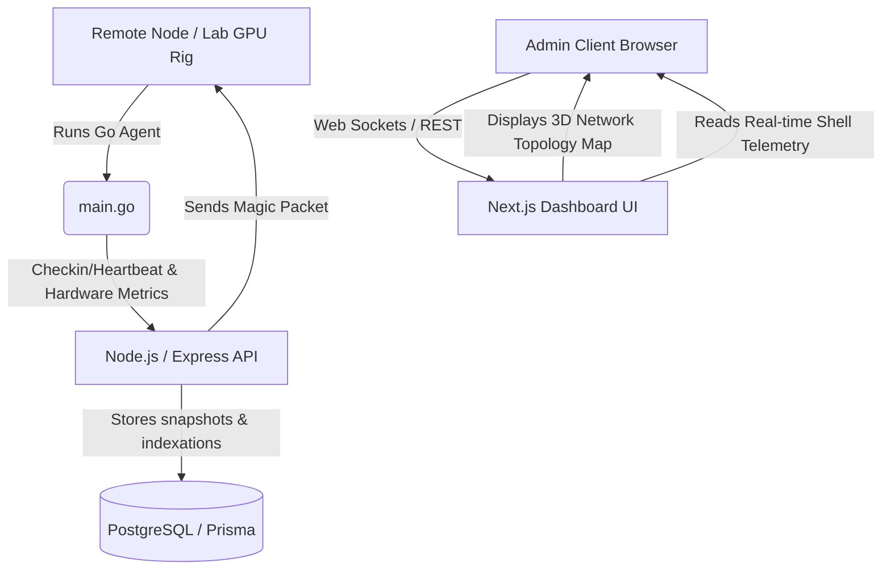

# Lab OS: Tactical Laboratory Inventory & Real-Time Telemetry Suite

<p align="center">
  
  
  
  
  
</p>

Lab OS is an enterprise-grade tactical system monitoring console designed for high-density compute labs. Combining real-time metric streams, remote Wake-on-LAN power triggers, and a unified 3D holographic operation center.

---

## 🏛️ System Architecture



1. **Go Agent (`/agent`)**: A lightweight Go binary running daemonized on remote laboratory machines. It collects CPU, memory (RAM), disk partition utilization, and local package lists, then dispatches them as check-in payloads to the backend controller.
2. **REST API Backend (`/backend`)**: A Node.js and TypeScript Express application. Handles payload validation, authentication (JWT), request rate limiting, database operations (via Prisma Client), and executes remote Wake-on-LAN packets.
3. **Tactile Holographic UI (`/frontend`)**: A Next.js 15 Web interface built with Tailwind CSS, Framer Motion, and Three.js (via `@react-three/fiber` and `@react-three/drei`). Provides 3D grid layouts, visual topology maps, interactive terminal readouts, and resource charts.

---

## 📸 Interface Preview

* **Holographic Operational Inventory**
  

* **Tactile Machine Diagnostic Panel**
  

---

## 🚀 Setup & Installation

### Prerequisites
* Node.js v18+
* Go 1.20+
* PostgreSQL Database Server

### 1. Database Configuration
1. Copy the `.env.example` file to `.env`:
   ```bash
   cp .env.example .env
   ```
2. Open `.env` and fill in your connection details:
   ```env
   DATABASE_URL="postgresql://<user>:<password>@localhost:5432/<db_name>?schema=public&connection_limit=10"
   JWT_SECRET="generate_a_secure_token_phrase"
   ALERT_WEBHOOK_URL="https://your.slack/webhook"
   ```

### 2. Backend Setup
1. Enter the backend directory and install dependencies:
   ```bash
   cd backend
   npm install
   ```
2. Push the Prisma database schema and generate client components:
   ```bash
   npx prisma db push
   ```
3. Run the development server with live reload:
   ```bash
   npm run dev
   ```

### 3. Frontend Setup
1. Enter the frontend directory and install dependencies:
   ```bash
   cd ../frontend
   npm install
   ```
2. Boot the Next.js development server:
   ```bash
   npm run dev
   ```

### 4. Running the Agent
1. Navigate to the agent directory:
   ```bash
   cd ../agent
   ```
2. Configure the server URL and your organization token inside the configuration block, then compile/run:
   ```bash
   go run main.go
   ```
